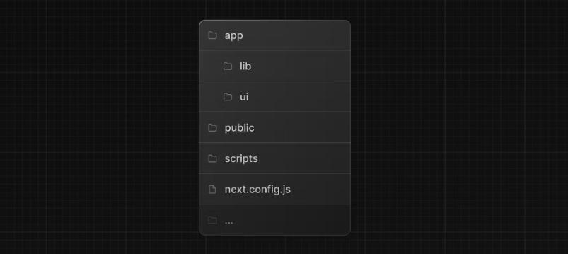

# Nextjs Essentials


## Introduction

Next.js is a React framework for building server-rendered React applications with ease. It simplifies the process of setting up and deploying React applications by providing a range of features out of the box.

### Why Next.js?

Next.js offers several advantages, including:

- **Server-Side Rendering (SSR):** Improved SEO and faster initial page loads.
- **Automatic Code Splitting:** Efficient loading of only the code needed for a particular page.
- **Simplified Routing:** Page-based routing based on the file system structure.
- **Built-in CSS Support:** Support for various styling approaches.


## Getting Started

### Setting up a Next.js Project

To create a new Next.js project, you can use the create-next-app command-line tool:

```
npx create-next-app my-nextjs-app
cd my-nextjs-ap
```

### Project Structure



- `/app`: Contains all the routes, components, and logic for your application, this is where you'll be mostly working from.
- `/app/lib`: Contains functions used in your application, such as reusable utility functions and data fetching functions.
- `/app/ui`: Contains all the UI components for your application, such as cards, tables, and forms. To save time, we've pre-styled these components for you.
- `/public`: Contains all the static assets for your application, such as images.
- `/scripts`: Contains a seeding script that you'll use to populate your database in a later chapter.
- **Config Files**: You'll also notice config files such as next.config.js at the root of your application. Most of these files are created and pre-configured when you start a new project using `create-next-app`. You will not need to modify them in this course.


## Routing in Next.js

### File-based Routing

Next.js uses a file-system-based router. For example, creating a file named `about.js` in the `pages` directory automatically creates the `/about` route.

### Dynamic Routes

Dynamic routes allow for the creation of pages with dynamic content. For instance, `[id].js` in the `pages` directory corresponds to `/posts/[id]`.

### Linking Between Pages

The `Link` component in Next.js enables client-side navigation between pages reducing the need for full-page reloads.

## Server-Side Rendering (SSR)

Server-side rendering involves rendering pages on the server rather than the client. This improves performance and SEO.

### Pages with `getServerSideProps`

The `getServerSideProps` function allows fetching data on each request, enabling dynamic content for SSR pages.
